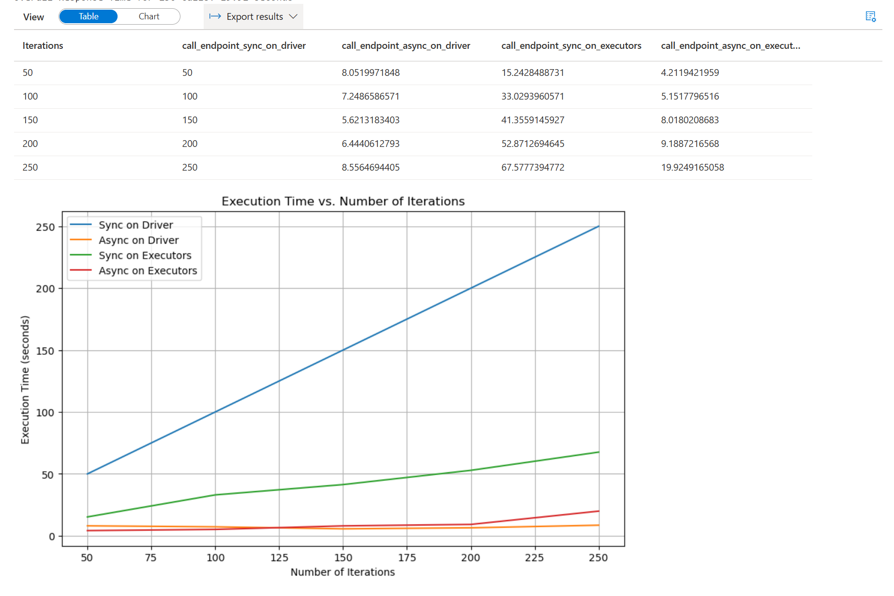
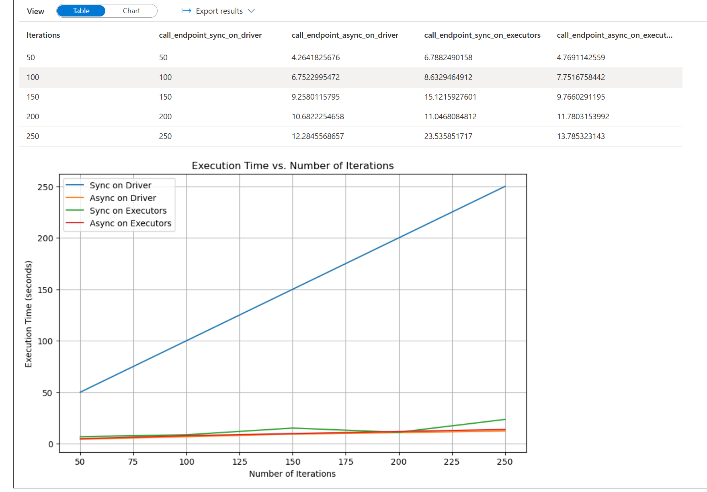

# Synapse HTTP Performance Testing

Experiment to optimize HTTP performance patterns when calling external services from a Spark cluster.

## Overview

This project evaluates different approaches for making high-volume HTTP requests from Apache Spark, comparing performance between driver-based and executor-based implementations, using both synchronous and asynchronous patterns.

## Test Scenarios

Four implementation patterns were evaluated:
1. Synchronous calls from the driver
2. Asynchronous calls from the driver
3. Synchronous calls distributed across Spark executors
4. Asynchronous calls distributed across Spark executors

The test involved calling an HTTP endpoint with typical response times of ~1 second, attempting to maximize throughput.

## Key Findings

- **Driver-side async implementation** showed the best performance for moderate workloads
  - Outperformed configurations using 5 small executors
  - Offers significant cost savings potential by reducing cluster size
  - Limited by scalability constraints:
    - Memory limitations on driver
    - No horizontal scaling capability

- **Executor-side async implementation** emerged as the second-best performer
  - Provides better scalability characteristics
  - Recommended for high-volume production workloads
  - Spark shows handling multiple tasks per executor in parallel: [img](assets/distributed%20-%20async.png)

- **Synchronous implementations**:
  - **Driver-side synchronous implementation** was used primarily as a benchmark
    - Scales linearly with the number of requests (e.g., 100 requests take 100 seconds)
    - Demonstrates expected lower performance compared to async patterns

  - **Executor-side synchronous implementation** leverages parallelization but inefficiently
    - Runs only one HTTP request per executor at a time? Or per core? - not sure.
    - Very expensive way to scale due to inefficient resource utilization
    - Spark shows handling single tasks per executor in parallel: [img](assets/distributed%20-%20sync.png)

## Results

Running with 1 executor:

Running with 5 executors:

## Links

- Experiment notebook: [notebook.ipnb](src/notebooks/notebook.ipynb)
- Infrastructure: [bicep template](src/infra/main.bicep)
- Azure function stub: [python code](src/func/function_app.py)
